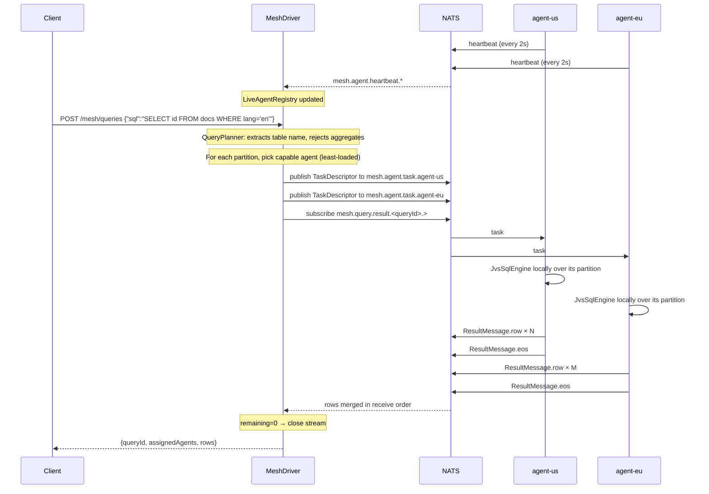
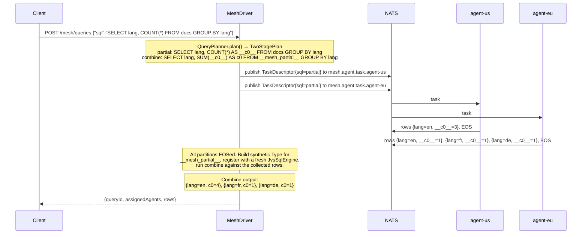

# Hitorro Mesh Architecture

This doc is for people who need to reason about the mesh's guts — modify
the executor, add a shuffle boundary, wire in a new transport, or debug why
a query lost a row. If you're just trying to run a query, read
[`README.md`](./README.md) instead.

## Spark analogy (for orientation)

| Spark component        | Hitorro Mesh equivalent                                                                                    |
|------------------------|------------------------------------------------------------------------------------------------------------|
| `SparkSession` / driver | `MeshDriver` in `hitorro-mesh-driver-app`, one JVM                                                        |
| Executor JVM per node  | `MeshAgent` in `hitorro-mesh-agent-app`, one JVM per node (or per shard)                                  |
| Row / `Dataset[Row]`   | `JVS` document (JSON with type system)                                                                    |
| Catalyst optimizer     | Apache Calcite (already inside jvssql)                                                                    |
| Spark SQL              | jvssql — every agent runs a full `JvsSqlEngine` locally against its partition                             |
| Shuffle (block manager)| Phase 2: per-partition NATS JetStream subjects                                                            |
| Cluster manager (YARN) | Orion or Kubernetes (bridges are separate modules)                                                        |
| Broadcast variables    | Phase 2: agents cache small reference tables locally, driver refresh via NATS                             |
| Storage (HDFS)         | `basefile` (local/S3/HDFS), plus kvstore / Lucene / Mongo for phase 2 source kinds                       |

Structured Streaming maps directly onto jvssql's existing streaming
support (TUMBLE / HOP / SESSION + watermarks). A distributed streaming
query is a long-lived DAG whose stages consume from JetStream / Kafka /
NATS sources and write to sinks — nothing new invented; the mesh just
distributes the operators.

## Query lifecycle (phase 1)



## Two-stage query lifecycle (phase 2)

Distributed `GROUP BY` with associative aggregates splits into a partial
plan (per-partition, on agents) and a combine plan (single pass on the
driver over the union of partial rows). Same NATS surface as phase 1 —
no new subjects, no new operators. Everything happens inside the
{@code QueryPlanner} + {@code QueryDispatcher} pair.



### Combine rules

| Source aggregate | Partial column       | Combine aggregate |
|------------------|----------------------|-------------------|
| `COUNT(*)`       | `__c<i>N</i>__: COUNT(*)`   | `SUM(__c<i>N</i>__)` |
| `SUM(x)`         | `__c<i>N</i>__: SUM(x)`     | `SUM(__c<i>N</i>__)` |
| `MIN(x)`         | `__c<i>N</i>__: MIN(x)`     | `MIN(__c<i>N</i>__)` |
| `MAX(x)`         | `__c<i>N</i>__: MAX(x)`     | `MAX(__c<i>N</i>__)` |

AVG is deliberately out until phase 2.5 — it needs decomposition to
SUM + COUNT, which requires a real Calcite-based planner. See
`QueryPlanner`'s Javadoc for the design decision.

### Combiner on driver vs. distributed combine

Correctness is identical for associative+commutative aggregates. The
tradeoff is scalability: if the group cardinality is huge (millions of
distinct keys), the driver becomes the bottleneck. Phase 2.5 will add a
shuffle sink at the agents (per-key hash to N shuffle subjects) + a
stage-2 combine worker pool — same architectural shape as Spark's
reduce-side aggregation.

## Data flow within an agent

```
NATS → task subject
  ↓
TaskExecutor.runOne(TaskDescriptor)
  ↓
Find LocalTable matching (sourceTable, partitionKey)
  ↓
new JvsSqlEngine().registerStream(sourceTable, local.openScan(), local.type()).build()
  ↓
engine.compile(task.sqlPlan)   ← Calcite parses, validates, plans
  ↓
q.asIterator() ← Iterator<JsonNode>
  ↓
for each row:  publish ResultMessage.row(...) to result subject
end:           publish ResultMessage.eos(...)
```

Every task compiles its own engine — cheap because there's no data yet.
Registering the local scan as the single stream lets Calcite validate the
identifier `FROM docs` against the agent's local `Type` for that partition.

## Data flow at the driver

```
QueryDispatcher.submit(sql)
  ↓
QueryPlanner.plan(sql) → tableName + guardrail check
  ↓
For each partition p of the DistributedTable:
    LiveAgentRegistry.pick(p.requiredCapabilities) → agent
    publish TaskDescriptor to mesh.agent.task.<agent.id>
  ↓
Subscribe mesh.query.result.<queryId>.>
  ↓
Handler queues ResultMessage.row into LinkedBlockingQueue
             decrements remaining on ResultMessage.eos
             puts a QueryError + EOS_ALL on ResultMessage.error
  ↓
QueryHandle.collect(timeout) blocks the caller, drains the queue
```

## Why this design

### 1. Transport is pluggable via a narrow SPI

`MeshTransport` is 3 methods: `publish`, `subscribe`, `close`. That's it.
Everything the mesh does — dispatch, result merge, heartbeat, control —
is a wildcard subscribe and a fire-and-forget publish. The narrow SPI is
deliberate: `InMemoryMeshTransport` is ~50 lines, `NatsMeshTransport` is
~70 lines. When we add a Kafka or Chronicle-Queue transport it'll be the
same shape.

### 2. Capability-based routing, driver-side

Agents publish what they can do; the driver picks. We didn't use NATS
queue groups because the mesh needs *deterministic* placement (data
locality — a task for partition `shard-3` must go to the agent that
holds `shard-3`, not any random agent in a pool). The `LiveAgentRegistry`
holds the mapping, and dispatch is one direct publish to a specific
agent's subject.

### 3. SQL text is the wire format for plans

Tempting alternative: serialize the Calcite `RelNode` sub-plan with
`RelJson`. We tried this mentally and rejected it because:

- RelJson is tightly coupled to Calcite versions; agent and driver would
  have to run lockstep versions.
- Debugging is painful — you can't `nats sub 'mesh.agent.task.>'` and read
  what's flowing.
- The agent's jvssql already knows how to parse SQL. Re-parsing costs microseconds.

Cost: the driver can't ship RelNode-level annotations (e.g., "already
hash-partitioned by X"). Phase 2 introduces a `ShuffleSpec` field on
`TaskDescriptor` for the annotations that actually matter (partition
scheme + key columns), keeping SQL as the primary carrier.

### 4. Phase 1 rejects what it can't do correctly

`QueryPlanner` uses a regex screen to fail fast on GROUP BY / JOIN / etc.
This is not a permanent design — phase 2 replaces it with real
plan-splitting. But **quietly returning per-partition partial aggregates
is a wrong-answer bug**, and wrong-answer bugs are the worst kind. The
screen exists so nobody ships a "SELECT COUNT(*)" dashboard against the
phase-1 mesh and gets 3× the true count without noticing.

### 5. Synchronous in-memory transport

Discovered the hard way: with async dispatch, ROW and EOS messages
published in order can be *delivered* out of order (two dispatcher threads,
one picks each). Fix was to make the in-memory transport dispatch on the
publishing thread. NATS-backed transport doesn't have this problem
because each NATS dispatcher subscription is single-threaded per
subscription.

## What phase 2 changes (preview)

- **`ShuffleSpec` on `TaskDescriptor`** — declares partition function
  (hash / range / round-robin) + key column(s). Stages exchange data
  through hash-per-key result subjects instead of one shared subject.
- **Two-stage execution for GROUP BY / JOIN**: stage 0 does the per-partition
  local aggregate on a partial-key basis, stage 1 reads shuffle output on
  the destination partition, does the final combine.
- **JetStream** replaces plain pub/sub for shuffle subjects. Losing a
  partial aggregate would corrupt the final answer; JetStream's durable
  consumers + ACKs guarantee delivery.
- **`QueryPlanner`** is replaced by real Calcite plan-splitting. The regex
  screen goes away.
- **`Executor`** gets a `SinkOperator` that publishes rows keyed by a
  partition function to shuffle subjects, and a `SourceOperator` that
  reads a specific shuffle subject as an iterator.

## Failure modes and current behavior

| Failure                                       | Phase-1 behavior                                                                                             |
|-----------------------------------------------|--------------------------------------------------------------------------------------------------------------|
| Agent process dies mid-task                   | Driver blocks until timeout, then throws. Phase 2: task-level retry via JetStream re-delivery.               |
| NATS unavailable                              | jnats retries indefinitely (configured `maxReconnects=-1`); publishes buffer briefly then error.             |
| Agent lacks the required partition            | `TaskExecutor.findLocalTable` returns null; agent publishes `ResultMessage.error`.                            |
| Two agents advertise the same partition       | `LiveAgentRegistry.pick` returns the least-loaded — deterministic, no double-scan. Duplicate data still an error the user has to fix. |
| Result row larger than NATS max payload (1MB) | Fails at publish. Phase 2: chunk large rows.                                                                 |
| Query with no live agent for a partition      | `QueryDispatcher.submit` throws before publishing anything.                                                  |

## File map (what to read to understand X)

| I want to understand...          | Read                                                                       |
|----------------------------------|----------------------------------------------------------------------------|
| The wire protocol                | `hitorro-mesh-core/src/main/java/com/hitorro/mesh/*.java`                  |
| How an agent picks up a task     | `hitorro-mesh-agent/**/MeshAgent.java` + `TaskExecutor.java`               |
| How the driver splits a query    | `hitorro-mesh-driver/**/QueryPlanner.java` + `QueryDispatcher.java`        |
| How live agents are tracked      | `hitorro-mesh-driver/**/LiveAgentRegistry.java`                            |
| The REST surface                 | `hitorro-mesh-driver-app/**/MeshRestController.java`                       |
| The end-to-end demo path         | `hitorro-mesh-examples/**/ExampleClusterRunner.java`                       |
| Reproducer scripts               | `hitorro-mesh-examples/scripts/*.sh`                                       |
| Phase-2 shuffle plans            | Grep for `Phase 2` in the source                                           |
