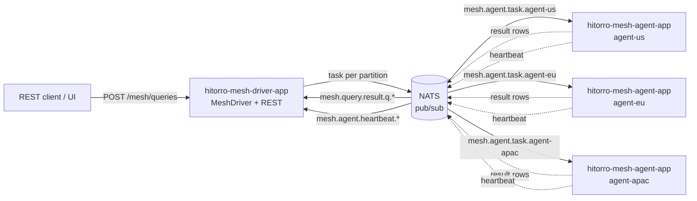

# Hitorro Mesh

A **Spark-like distributed compute layer over the Hitorro stack.** Runs
distributed SQL queries against `JVS` document streams across a cluster of
worker processes, using NATS for messaging.

Same code runs three ways: **one JVM (in-memory transport, for demos and
tests)**, **local multi-process with real NATS (for iteration)**, and
**production cluster (Orion or Kubernetes)**. The transport is the only
thing that changes — driver, agent, and query semantics are identical.



## Modules

| Module                    | Purpose                                                                                                                      |
|---------------------------|------------------------------------------------------------------------------------------------------------------------------|
| `hitorro-mesh-core`       | Protocol types, `Subjects` naming, `MeshTransport` SPI, `InMemoryMeshTransport`. Zero Spring, zero platform code.            |
| `hitorro-mesh-agent`      | `MeshAgent` — heartbeat publisher + task executor. Framework-free.                                                           |
| `hitorro-mesh-driver`     | `MeshDriver`, `LiveAgentRegistry`, `DistributedTable`, `QueryDispatcher`, phase-1 `QueryPlanner`.                             |
| `hitorro-mesh-nats`       | `NatsMeshTransport` implementing `MeshTransport` over jnats. Plain pub/sub in phase 1; JetStream in phase 2.                 |
| `hitorro-mesh-examples`   | Runnable in-JVM demo (`DocsByLanguageExample`), integration tests, `scripts/` for local NATS smoke test.                     |
| `hitorro-mesh-agent-app`  | Spring Boot deployable — one fat JAR that reads capabilities from properties/env and joins the mesh.                         |
| `hitorro-mesh-driver-app` | Spring Boot deployable — one fat JAR with REST (`POST /mesh/queries`, `GET /mesh/agents`) and actuator health.               |

## Phase status

**Phase 1 (shipped):** distributed `SELECT ... WHERE ... project` across
partitioned tables. Union at driver.

**Phase 2 (shipped):** distributed `SELECT gcols, AGG(...) FROM t
[WHERE ...] GROUP BY gcols` where `AGG ∈ {COUNT, SUM, MIN, MAX}` (all
associative and commutative). Planner splits into a partial plan
(runs per-partition on each agent) and a combine plan (runs once at the
driver over the union of partial rows). See
[ARCHITECTURE.md § Two-stage query lifecycle](./ARCHITECTURE.md#two-stage-query-lifecycle-phase-2).

**Phase 2.5.1 (shipped):** distributed combiner via hash-repartition
shuffle. Combine now runs on second-stage worker tasks instead of the
driver. Enable with `hitorro.mesh.driver.shuffle-width: N` (0 = phase-2
combiner-at-driver, deterministic default; N&gt;0 = distributed combine
across up to N combine workers). Same correctness for
COUNT/SUM/MIN/MAX GROUP BY — removes the "combine fits in driver RAM"
scalability cap.

**Phase 3 (shipped):** AVG, SELECT DISTINCT, HAVING. All three land as
`QueryPlanner` rewrites — AVG decomposes to SUM+COUNT partials + division
combine, SELECT DISTINCT rewrites to GROUP BY, HAVING rewrites aggregate
references to combine expressions.

**Phase 4a (shipped):** broadcast JOIN. Small dimension tables pre-loaded
on every agent (via `hitorro.mesh.agent.broadcast-tables`) can be JOINed
against the distributed fact table. Composes with WHERE / GROUP BY /
HAVING / shuffle transparently.

**Phase 4b (shipped):** shuffle-hash JOIN for fact × fact. Two distributed
tables joined by an equijoin key — both sides shuffle into the same
N-bucket grid, per-bucket combine workers run the local JOIN. Uses the
same `hitorro.mesh.driver.shuffle-width` knob (defaults to 1 for
shuffle-joins).

**Phase 5a (shipped):** driver-side `LIMIT N` for any plan shape.

**Phase 5b (shipped):** distributed `ORDER BY` with driver-side global
sort. Multi-column, ASC/DESC, SQL NULL semantics. Composes with LIMIT
for top-N queries.

**Phase 5b.1 (shipped):** ORDER BY composes with every plan shape —
simple scans, GROUP BY aggregates, shuffle-hash joins. The classic
`SELECT lang, COUNT(*) FROM docs GROUP BY lang ORDER BY c0 DESC LIMIT 3`
works end-to-end.

**Phase 6a (shipped):** streaming source foundation.
[`InMemoryStreamingTable`](../hitorro-mesh-agent/src/main/java/com/hitorro/mesh/agent/InMemoryStreamingTable.java)
is a `LocalTable` whose scan iterator blocks on a queue — agents keep
publishing rows as they're pushed, driver's handle yields them in real
time.

**Phase 6c.1 (shipped):** `GET /mesh/queries/stream` — Server-Sent
Events endpoint. Composes with the streaming source for real-time
client-facing streaming.

**Phase 6c.2 (shipped):** cancel-through-to-agents. `QueryHandle.close()`
publishes a `CancelMessage` on the control subject; agents interrupt
matching in-flight workers, streaming iterators unblock cleanly. Makes
streaming production-safe (no thread leaks).

**Phase 6b (shipped):** real streaming source bindings — optional
adapter modules
[`hitorro-mesh-streaming-kafka`](../hitorro-mesh-streaming-kafka/) and
[`hitorro-mesh-streaming-nats`](../hitorro-mesh-streaming-nats/) wrap
the existing `hitorro-streams-kafka` / `hitorro-streams-nats` sources
as `LocalTable` implementations. Pull the adapter jars in when agents
consume from real brokers.

**Phase 6b.1 (shipped):** Kafka / NATS streaming tables are declared
directly in the agent-app YAML — no Java glue needed. Each `tables:`
entry picks its source by which nested block is present (`ndjson-file:`
for batch, `kafka:` for a Kafka topic, `nats:` for a JetStream subject).
Adapter modules are now regular deps of the agent-app fat-jar so
config-only deployments work out of the box.

**Phase 6d (shipped):** windowed aggregation. Function-call group columns
work — `SELECT WIN_START(event_time, 60000), COUNT(*) FROM events
GROUP BY WIN_START(event_time, 60000)` distributes correctly.
Auto-alias `g0`, `g1`, ... on function-call group cols; simple column
refs still keep their original name.

**Phase 4c (shipped):** `LEFT / RIGHT / FULL OUTER JOIN` against a
broadcast table. Unmatched left rows come through with null-padded right
side. Composes with GROUP BY / ORDER BY / LIMIT. Zero planner changes
needed — jvssql handles OUTER semantics locally per partition.

**Phase 4c.1 (shipped):** shuffle-hash `LEFT / RIGHT / FULL OUTER JOIN`
between two distributed tables. Each side's JVS type ships in the
`CombineSpec` so empty buckets can register an empty-but-typed stream —
jvssql then null-pads unmatched rows correctly. Also extended jvssql's
`HashJoinIterator` (originally INNER+LEFT only) to support RIGHT and
FULL by tracking matched-right-rows during the probe and walking the
hash for unmatched rights after the left iterator exhausts.

**Phase 7a (shipped):** TLS + auth for the NATS transport. New
`NatsSecurity` config carries username/password, token, .creds file
path, TLS flag, and PKCS12/JKS truststore + keystore paths — auth
precedence is `creds > token > user/pass`, TLS activates via explicit
flag OR custom trust material OR `tls://` URL scheme. Wired through
matching `nats-security:` YAML blocks on both `hitorro.mesh.agent` and
`hitorro.mesh.driver`. Verified end-to-end via
`scripts/mesh-tls-smoke.sh` — self-signed CA, TLS-secured NATS, mesh
running over `tls://`.

**Phase 4b.1 (shipped):** WHERE composes with shuffle-hash JOIN
(INNER + all OUTER variants). The combine SQL runs the ORIGINAL
query verbatim, so WHERE just filters per-row inside each bucket —
one-line planner change plus coverage.

**Phase 4b.2 (shipped):** GROUP BY + aggregates (COUNT/SUM/MIN/MAX/AVG,
+ HAVING) compose with shuffle-hash JOIN. New `ShuffleJoinAggregatePlan`
variant carries both shuffle-join fields AND two-stage-plan fields;
`submitShuffleJoinAggregate` executes as 3 stages — shuffle both sides,
per-bucket combines run partial-aggregate SQL over the joined rows,
driver reduces the partials to final aggregates. Reuses `planTwoStage`'s
aggregate-rewriting machinery verbatim (only the FROM clause changes to
carry the JOIN). Global aggregate (`SELECT COUNT(*) FROM a JOIN b`
without GROUP BY) works too — one row across all buckets.

**Phase 4b.2.1 (shipped):** WHERE pushdown to per-side scans. Single-side
conjuncts of the WHERE clause apply at the per-side scan tasks BEFORE
shuffle, dramatically cutting bandwidth for filtered queries.
Safe-subset: top-level AND-decomposition, per-side qualifier
attribution, no OR at top level. Combines still evaluate the full
WHERE (redundant but bug-safe — extra CPU per surviving row, not
wrong results).

**Phase 6d.1 (shipped):** watermark-driven windowed streaming.
Long-lived windowed aggregate queries over streaming sources —
windows close and emit incrementally as the watermark advances past
their end time, no waiting for end-of-scan. Zero wire protocol
changes: agent registers streaming source with jvssql's `StreamConfig`,
jvssql auto-swaps to incremental `StreamingAggregate` executor.

**Phase 6d.2 (shipped):** multi-partition streaming aggregate. Each
partition runs partial aggregate via streaming; driver reduces per-window
partials across partitions incrementally using an advance-past close
heuristic (window `W` closes globally when every partition has emitted
for window `>= W`). Combine SQL runs over the per-window batch via a
small jvssql engine — same reducers as phase-2 combine. On EOS from
all partitions, remaining buffered windows flush unconditionally.
`StreamingSimplePlan` renamed to `StreamingWindowedPlan` carrying both
the original SQL (single-partition path) and partial/combine SQL
(multi-partition path); dispatcher branches on partition count.

**Phase 6d.2.1 (shipped):** watermark heartbeats. New
`ResultMessage.Kind.WATERMARK` message; streaming scan tasks publish
one every 200ms with the partition's max observed `event_time`. Driver
converts to a "highest closed window" via the WIN_START step size, so
partitions whose watermark has crossed a boundary WITHOUT emitting rows
in the intervening windows still advance the global close detector.
Fixes the sparse-emitter stall documented in phase 6d.2.

**Phase 6d.2.2 (shipped):** idle-timeout watermarks. Closes the pure-idle
stall (a partition with zero events, or extended quiescence). If a
partition has been silent for longer than `hitorro.mesh.watermark.idle-timeout-ms`
(default 30s), its watermark advances based on wall-clock. Assumes
event-time flows at real-time rate — safe default for real-time streams;
opt out via a very large value for backfill scenarios.

**Phase 6d.2.3 (shipped):** user-alias preservation through combine.
Combined output honors the user's `AS foo` aliases from their SELECT
list — no more surprise `g0`/`c0` column names for aliased queries.

**Phase 7b (shipped):** query timeouts + cancel propagation.
`QueryDispatcher.submit(sql, Duration)` arms a hard deadline; on
expiry, `CancelMessage` reaches every agent working on that queryId
and the handle closes with `timedOut() == true`. REST endpoint uses
this by default. `onCloseUnblock` runnable pattern signals waiting
`nextRow` callers cleanly (no interrupt).

**Phase 5b.2 (shipped):** N-way merge sort for `SimplePlan + ORDER BY`.
Driver memory is O(N partitions) instead of O(total rows) — each
partition already sorts locally (via pushdown), driver merges the
per-partition heads via a priority queue and streams the output.

**Phase 5b.3 (shipped):** LIMIT pushdown to agents for `SimplePlan`.
Each partition returns at most N rows to the driver.

**Phase 4c.1 / 6d.1+ (planned):** Shuffle-hash OUTER joins (fact × fact),
watermark-driven windowed streaming (windows flush as watermarks advance
in a long-lived query). See [`ROADMAP.md`](./ROADMAP.md).

**Bridges (planned):** `hitorro-mesh-orion`, `hitorro-mesh-k8s` for
platform-specific declared-agent enrichment and deploy templates. See
`docs/mesh-orion.md` and `docs/mesh-kubernetes.md`.

## Quick start (Tier 1 — in-JVM, zero deps)

```bash
# From repo root
cd hitorro-mesh-examples
mvn exec:java -Dexec.mainClass=com.hitorro.mesh.examples.DocsByLanguageExample
```

Expected output: three partitions boot as in-process agents, driver runs
two `WHERE`-only queries and prints unioned results, plus a `GROUP BY`
query that is intentionally rejected with the phase-1 guard message.

## Quick start (Tier 2 — local NATS, multi-process)

Prereqs: `nats-server` on `$PATH` (Orion ships one at `~/.orion/bin/nats-server`).

```bash
cd hitorro-mesh-examples/scripts
./mesh-init-data.sh          # creates /tmp/hitorro-mesh-smoke/{types,data,config,logs}
./mesh-up.sh                 # starts nats + driver + 2 agents in the background
./mesh-status.sh             # curls /mesh/agents until 2 show up
./mesh-query.sh "SELECT id, title FROM docs WHERE lang = 'en'"
./mesh-down.sh               # kills everything cleanly
```

You should get 4 English documents (3 from `us`, 1 from `eu`) merged in
the response.

## Query console (built-in web UI)

The driver JAR includes a **zero-dependency HTML+JS query console** at the
root path — no npm, no build step. Open [http://localhost:8085/](http://localhost:8085/)
after starting the driver:

- Sidebar of preset queries (phase-1 filter, phase-2 GROUP BY, guardrails)
- SQL editor (Cmd/Ctrl-Enter to run)
- Result table with column auto-discovery
- Live agent list (auto-refreshes every 3s from `/mesh/agents`)
- Registered distributed tables + their partitions

The console is served as `static/index.html` from the driver-app JAR
(`hitorro-mesh-driver-app/src/main/resources/static/index.html`). Ship
it as-is or replace with your own SPA — Spring Boot's static-resource
handling has no opinion.

## Quick start (Tier 3 — Orion cluster)

See [`docs/mesh-orion.md`](../docs/mesh-orion.md) — declares the driver as
an Orion Service and one agent Service per node, capability-tagged with
which shard the node holds.

## Quick start (Tier 3 alt — Kubernetes)

See [`docs/mesh-kubernetes.md`](../docs/mesh-kubernetes.md) — Helm chart
that deploys the driver as a Deployment + Service and agents as a
StatefulSet (stable identity per shard) or DaemonSet (one per node).

## REST reference

### `POST /mesh/queries`

```bash
curl -s -X POST http://driver:8085/mesh/queries \
  -H 'Content-Type: application/json' \
  -d '{"sql":"SELECT id FROM docs WHERE lang = '"'"'en'"'"'","timeoutMs":5000}'
```

Response:
```json
{
  "queryId": "b1914336",
  "assignedAgents": ["agent-us", "agent-eu"],
  "rowCount": 4,
  "rows": [ { "id": "eu-3" }, { "id": "us-1" }, ... ]
}
```

Queries the planner can't rewrite (e.g. `UNION`, or a non-broadcast JOIN)
return `400` with a machine-readable error message.

### `GET /mesh/queries/stream` (SSE — phase 6c.1)

Server-Sent Events variant — one event per row, streamed as they arrive:

```bash
curl -N 'http://driver:8085/mesh/queries/stream?sql=SELECT+id+FROM+docs+WHERE+lang%3D%27en%27'
```

Event sequence:
```
event: opened      data: {"queryId":"…","assignedAgents":[…]}
event: row         data: {"id":"us-1","lang":"en"}
event: row         data: …
event: complete    data: {"queryId":"…","rowCount":4}
```

Composes with the phase-6a streaming source (rows arrive at the client
in real time as they're pushed at the source). Client disconnect closes
the QueryHandle on the driver.

### `GET /mesh/agents`

```bash
curl -s http://driver:8085/mesh/agents | jq
```
```json
[
  { "agentId": "agent-us", "capabilities": ["jvssql", "partition:docs:us"], "startedAtMillis": 1786596929223 },
  { "agentId": "agent-eu", "capabilities": ["jvssql", "partition:docs:eu"], "startedAtMillis": 1786596934883 }
]
```

### `GET /mesh/tables`

Lists registered distributed tables and their declared partitions.

### `GET /actuator/health`

Standard Spring Boot health endpoint. Returns 200 if the driver process is
alive; use `/mesh/agents` to check mesh membership.

### `GET /actuator/prometheus`

Prometheus scrape endpoint. Standard JVM meters (`jvm_*`, `process_*`,
`http_server_requests_seconds`) plus mesh-specific meters:

| Meter                                 | Type      | What it says                                              |
|---------------------------------------|-----------|-----------------------------------------------------------|
| `mesh_queries_total{outcome}`         | counter   | Query submissions, tagged `ok` / `error`                  |
| `mesh_query_duration_seconds{outcome}`| histogram | Wall-clock submit-to-result-complete duration             |
| `mesh_rows_returned_total`            | counter   | Total result rows delivered to clients                    |
| `mesh_agents_live`                    | gauge     | Currently-heartbeating jvssql-capable agents              |
| `mesh_tables_registered`              | gauge     | Distributed tables in the registry                        |
| `mesh_broadcast_tables_registered`    | gauge     | Broadcast tables in the registry                          |

To enable, put `management.endpoints.web.exposure.include: prometheus`
in the driver config (already the default in the packaged
`application.yml`; smoke-script config also includes it).

## Capabilities — what agents advertise

Capabilities are just tags — the driver matches them against
`requiredCapabilities` on each partition. Convention:

| Tag                                | Meaning                                              |
|------------------------------------|------------------------------------------------------|
| `jvssql`                           | can execute jvssql sub-plans (every agent advertises) |
| `partition:<table>:<key>`          | holds partition `<key>` of table `<table>`           |
| `kvstore:<path>`                   | has a local kvstore at path                          |
| `lucene-index:<name>`              | has a local Lucene index                             |
| `gpu`, `arch:arm64`, `os:linux`    | hardware / OS tags                                   |

Set on the agent via `hitorro.mesh.agent.capabilities:` in YAML, or via
the `HITORRO_MESH_CAPABILITIES` environment variable (comma-separated).
Env is preferred in Orion (native env-based capability declaration) and
K8s (annotations → env via Downward API).

## NATS subjects

| Subject                                          | Direction         |
|--------------------------------------------------|-------------------|
| `mesh.agent.heartbeat.<agentId>`                 | agent → driver    |
| `mesh.agent.task.<agentId>`                      | driver → agent    |
| `mesh.query.result.<queryId>.<partitionKey>`     | agent → driver    |
| `mesh.query.control.<queryId>`                   | driver → agent    |

Wildcards in use:
- Driver subscribes `mesh.agent.heartbeat.>` for the live registry.
- Driver subscribes `mesh.query.result.<queryId>.>` to merge result streams.

## Design decisions worth reading before "improving"

Grep the source for `Design decision:` — each captures a rejected
alternative and why we chose what we did. Highlights:

- **SQL text is the plan wire format** (not a serialized Calcite RelNode).
  Round-trips cleanly and is debuggable when tailing a NATS subject.
  Phase 2 will extend the `TaskDescriptor` with a shuffle spec, but the SQL text stays the primary carrier.
- **`InMemoryMeshTransport` dispatches synchronously.** Preserves per-subject
  ordering (a ROW published before an EOS is definitely handled first,
  regardless of scheduling). NATS-backed transport can safely go async
  because JetStream preserves per-subject order.
- **`MeshTransport` is intentionally narrow.** No request/reply, no queue
  groups, no explicit ACKs. Everything expressed as publish + wildcard
  subscribe. Keeps the in-memory impl ~50 lines and forces designing around
  subject naming instead of transport-specific features.
- **Phase 1 forbids GROUP BY** via regex screening in `QueryPlanner`. Uses
  regex not a real parser because jvssql on the agents will parse the same
  SQL properly; the driver-side check exists only to fail fast with a clear
  message ("phase 1 doesn't support GROUP BY"). Phase 2 replaces this with
  real Calcite plan-splitting at shuffle boundaries.
- **NATS transport uses plain pub/sub, not JetStream.** Heartbeats and
  task dispatch are fine on best-effort delivery — a missed task retries.
  JetStream comes in phase 2 for shuffle output, where losing a partial
  aggregate would be wrong.
